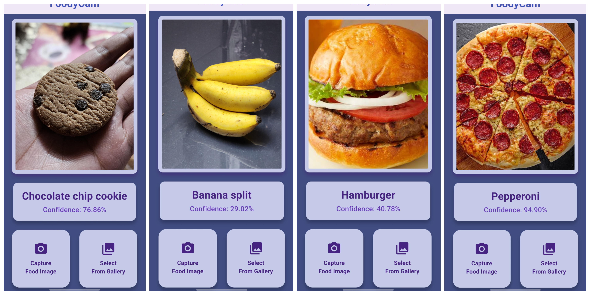

<!-- README.md (HTML version) -->

<h1 align="center">FoodyCam</h1>

  A cross-platform Flutter app for capturing and detecting food photos, with an accompanying AI experimentation notebook. The app has simple interface with codes that are clean. It is an excellent project for beginners who want to learn AI integration in their app.

  <a href="https://flutter.dev">Flutter</a> •
  <a href="https://dart.dev">Dart</a>

  
  
  

<h2>✨ Features</h2>
<ul>
  <li><strong>Camera-first UX</strong>: capture and organize food photos (extendable to filters, tags, sharing).</li>
  <li><strong>Cross-platform</strong>: Android, iOS, Web, Windows, macOS, and Linux from a single codebase.</li>
  <li><strong>AI playground</strong>: an included Jupyter Notebook to experiment with model loading and testing on images.</li>
  <li><strong>Clean structure</strong>: conventional Flutter project layout for easy navigation and contribution.</li>
</ul>

<h2>📸 Screenshots of the App</h2>

  

<h2>🚀 Quick Start</h2>

<h3>Prerequisites</h3>
<ul>
  <li> <a href="https://docs.flutter.dev/get-started/install">Flutter SDK</a> installed and on your <code>PATH</code>.</li>
  <li> Android Studio / Xcode (for mobile), Chrome (for web), and desktop enablement if targeting desktop.</li>
  <li> Python and Jupyter notebook to run the included AI_model_loading_and_testing_model.ipynb file </li>
</ul>

<h3>Clone & Run</h3>
<pre><code>git clone https://github.com/Iftikhar-Shams-Niloy/flutter_foodycam.git
cd flutter_foodycam
flutter pub get

# Mobile (attach a device/emulator)
flutter run

# Web
flutter run -d chrome

# Desktop (enable once per machine)
flutter config --enable-windows-desktop
flutter config --enable-macos-desktop
flutter config --enable-linux-desktop
flutter run -d windows   # or macos/linux
</code></pre>

<h2>🤖 AI Notebook (Optional)</h2>

  This repository includes <code>AI_model_loading_and_testing_model.ipynb</code> for experimenting with model loading/testing on images.
  You can open it in Jupyter or Google Colab and adapt any working pipeline to Flutter (e.g., via TensorFlow Lite).

<ol>
  <li>Open the notebook in Jupyter/Colab.</li>
  <li>Run cells to validate your model flow.</li>
  <li>Export/convert models (e.g., to TFLite) and integrate into the Flutter app.</li>
</ol>

<h2>📂 Project Structure</h2>
<pre><code>flutter_foodycam/
├─ android/       # Android platform code
├─ ios/           # iOS platform code
├─ web/           # Web support
├─ windows/       # Windows desktop
├─ macos/         # macOS desktop
├─ linux/         # Linux desktop
├─ assets/        # Images, fonts, etc.
├─ lib/           # Flutter/Dart source (main app)
│  ├─ core/                       # Core utilities and helpers
│  │   ├─ constants.dart          # Global constants
│  │   ├─ debug_logger.dart       # Custom debug utility
│  │   └─ error_handler.dart      # Error handling utility
│  │
│  ├─ data/                       # Data layer 
│  │   ├─ image_processor.dart    # Image preprocessing for the model
│  │   ├─ model_loader.dart       # Loads the TFLite model
│  │   └─ prediction_service.dart # Service to get predictions
│  │
│  ├─ domain/                     # Domain layer 
│  │   ├─ classify_food.dart      # Core classification logic
│  │   └─ prediction.dart         # Prediction model/entity
│  │
│  ├─ presentation/               # UI/Presentation layer
│  │   ├─ pages/
│  │   │   └─ home_screen.dart    # Main home screen
│  │   │
│  │   ├─ state/
│  │   │   └─ prediction_state.dart # State management for predictions
│  │   │
│  │   └─ widgets/
│  │       ├─ camera_view.dart               # Widget to preview camera
│  │       ├─ custom_elevated_buttons.dart   # Custom styled elevated buttons
│  │       └─ result_card.dart               # Widget to show prediction result
│  │
│  └─ main.dart                  # Entry point of the app
│
├─ AI_model_loading_and_testing_model.ipynb    # AI experimentation using Python JupyterNotebook
├─ pubspec.yaml                                # Dependencies & metadata
└─ README.md                                   # Project overview
</code></pre>

<h2>⚙️ Configuration & Environment</h2>
<ul>
  <li>Ensure required camera/gallery permissions are configured for Android/iOS.</li>
  <li>Add any runtime configuration (e.g., API keys) via <code>--dart-define</code> or environment files if needed.</li>
  <li>Keep assets declared in <code>pubspec.yaml</code> under the <code>assets:</code> section.</li>
</ul>

<h2> Dependencies</h2>

  Manage packages via <code>pubspec.yaml</code>. After edits, run <code>flutter pub get</code>.
  List key packages here (camera, image picker, state management, ML bindings, etc.) once finalized.

<h2>📁 Build</h2>
<ul>
  <li><strong>Android (APK/AppBundle)</strong>: <code>flutter build apk</code> / <code>flutter build appbundle</code></li>
  <li><strong>iOS</strong>: <code>flutter build ios</code> (then archive via Xcode)</li>
  <li><strong>Web</strong>: <code>flutter build web</code></li>
  <li><strong>Desktop</strong>: <code>flutter build windows|macos|linux</code></li>
</ul>

<h2>🤝 To Contribute In This Project</h2>
<ol>
  <li>Fork the repo &amp; create a feature branch: <code>git checkout -b feature/awesome</code></li>
  <li>Commit changes: <code>git commit -m "feat: add awesome"</code></li>
  <li>Push to your fork and open a Pull Request.</li>
</ol>

<h2>🗺️ Roadmap Ideas </h2>
<ul>
  <li>Classify and idenfity an image of food.</li>
  <li>Total offline application.</li>
  <li>On-device ML inference (e.g., TFLite) for food recognition.</li>
  <li>Click photo with camera or pick image from gallery directly for food classification.</li>
</ul>

   Made using Flutter 

